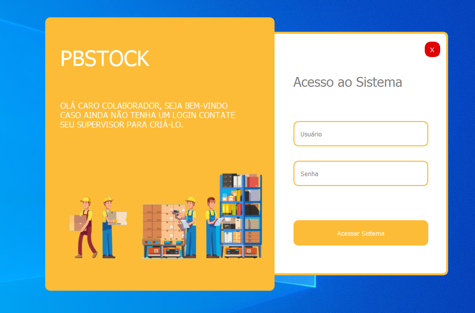
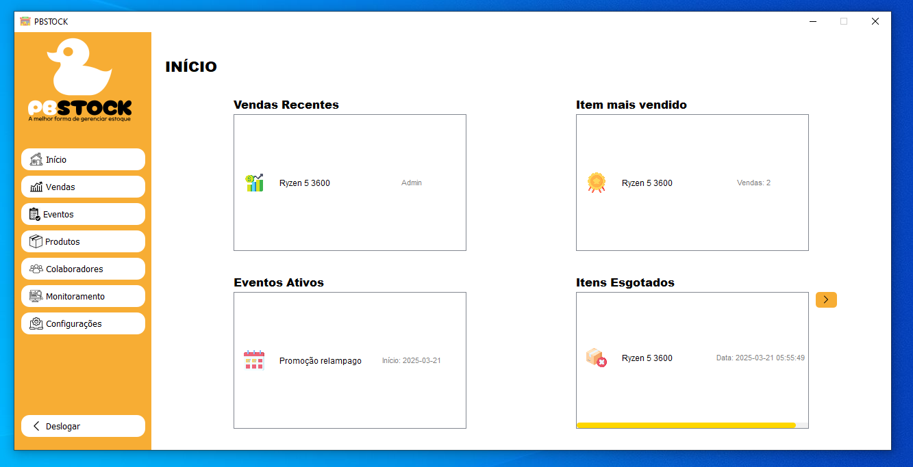
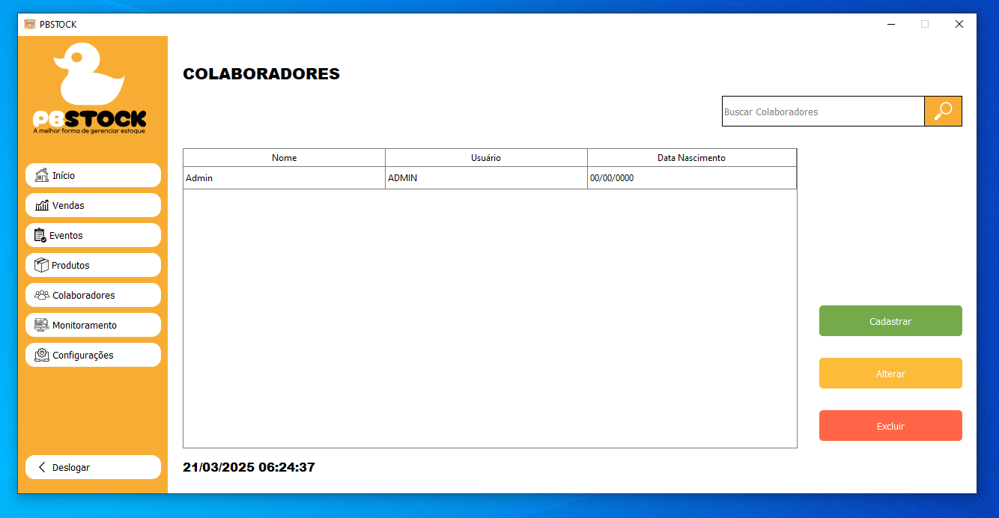
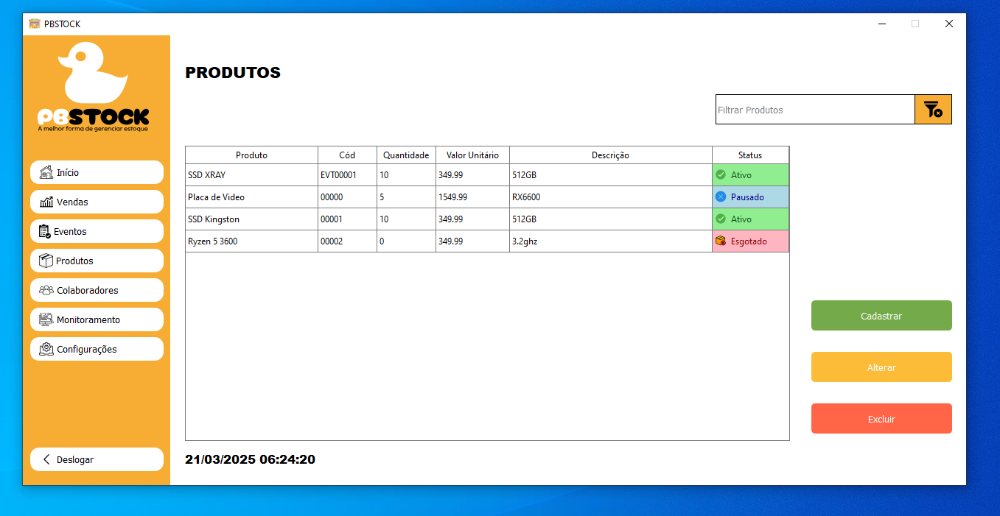
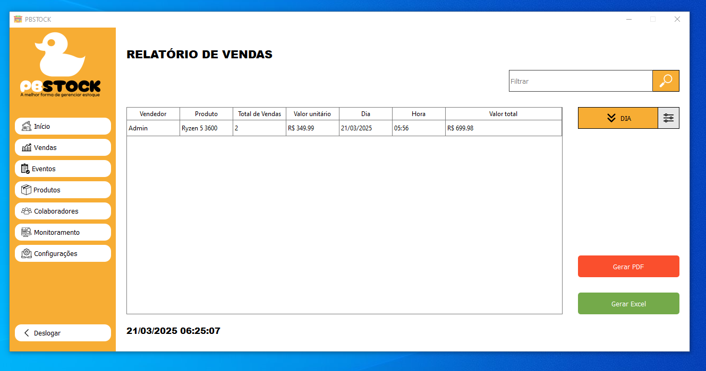
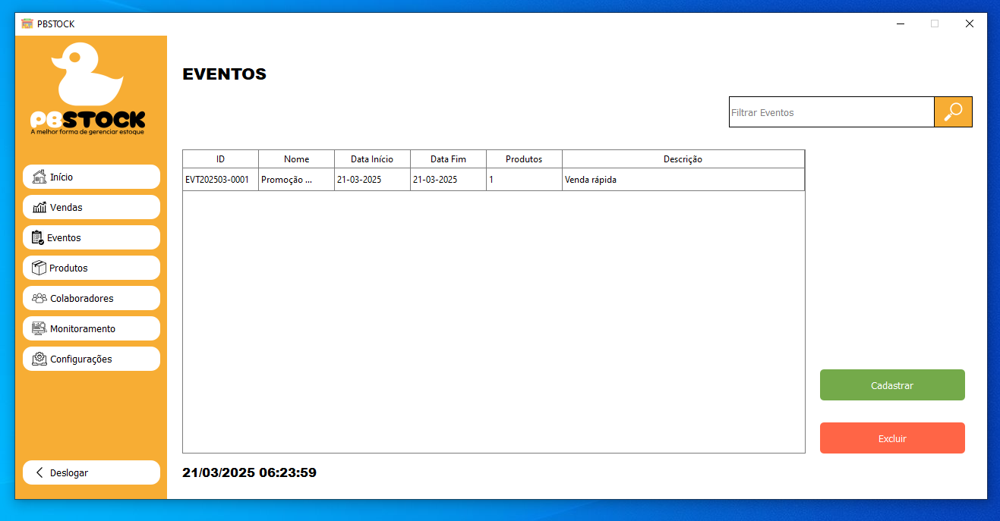
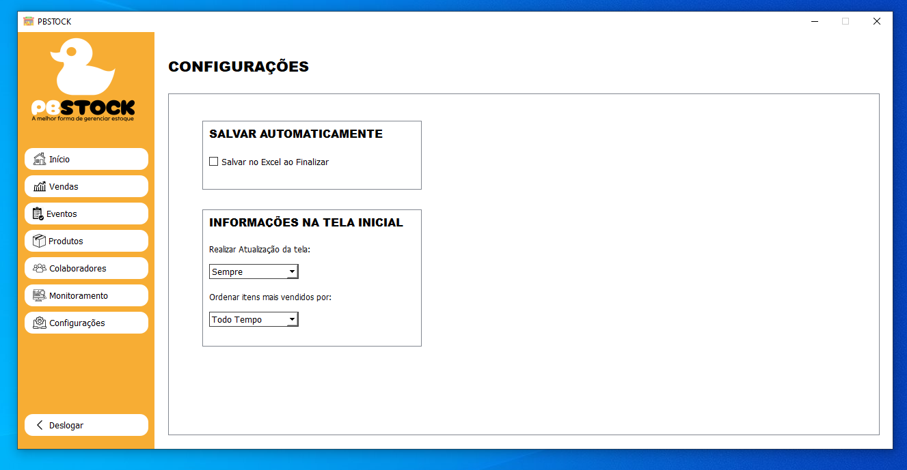
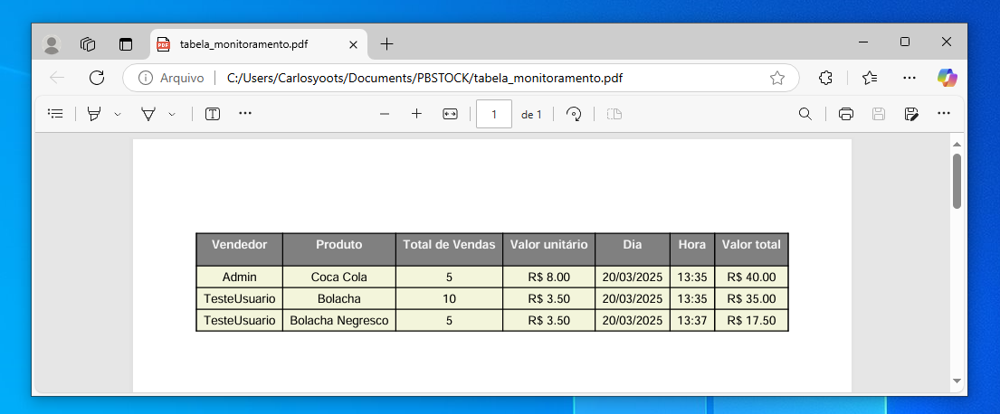
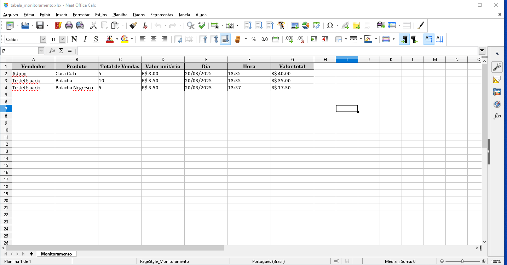

# 🏆 PBSTOCK - GERENCIAMENTO DE ESTOQUE  

**PYTHON - MYSQL - PYQT5 - ZEROMQ - POO**

  
  
  
  
  
  

🔹 **PBSTOCK** é uma solução **distribuída e eficiente** para o gerenciamento de estoques e vendas.  
🔹 Oferece **controle total de produtos, relatórios avançados e integração** com Excel e PDF.  
🔹 Seu design distribuído permite **operações em múltiplas filiais** com dados sempre sincronizados.  

🎥 **Demonstração do Projeto** → [Assista ao vídeo aqui](https://youtu.be/KYRcrwppV44)  

---

## 🚀 **Principais Recursos**  

### 📦 **1. Gerenciamento de Estoque**  
✅ Controle total do estoque em **tempo real**.  
✅ Alertas automáticos para **reposição de produtos**.  

### 🛒 **2. Vendas Simplificadas**  
✅ Registro de vendas em múltiplos canais (físico e online).  

### 📊 **3. Relatórios Poderosos**  
✅ Relatórios **detalhados e gráficos** sobre vendas e estoque.  
✅ Exportação para **Excel e PDF**.  

### 🎯 **4. Promoções e Eventos**  
✅ Criação de **descontos e promoções especiais**.  
✅ Automatização de eventos promocionais.  

### 🔗 **5. Integração com Excel e PDF**  
✅ Exportação de relatórios para **Excel e PDF** para fácil compartilhamento.  

### 🌎 **6. Sistema Distribuído**  
✅ Suporte para **múltiplas filiais** com **sincronização em tempo real**.  

### 🔐 **7. Segurança e Acessibilidade**  
✅ **Criptografia** avançada para proteger dados.  
✅ **Acesso remoto** seguro para gerenciamento à distância.  

---

## 🎯 **Benefícios do PBSTOCK**  

✅ **📊 Decisões mais estratégicas** → Com relatórios detalhados e insights poderosos.  
✅ **🛒 Vendas mais rápidas** → Registros organizados e automáticos.  
✅ **📦 Controle eficiente de estoque** → Evita excesso ou falta de produtos.  
✅ **🔗 Operação distribuída** → Ideal para empresas com **múltiplos pontos de venda**.  
✅ **🛡️ Segurança de dados** → Com **criptografia** e autenticação de usuários.  

---

## 🖥️ **Telas do Sistema**  

### 🔐 Login  
  

### 🏠 Tela Inicial  
  

### 👥 Colaboradores  
  

### 📦 Produtos  
  

### 💰 Vendas  
 

### 📅 Eventos  
  

### ⚙ Configurações  
  

### 🧾 Pdf  
  

### 🧾 Excel  
  

---

## 🛠️ **Como Instalar e Rodar o Projeto?**  

- **Execute o instalador disponível em realeses**
  **Instale MySql, MySqlServer e XAMPP**
  **Execute MySql e inicie o servidor local/próprio distribuído**
  **Importe o banco pbstock.sql no local/servidor**
  **Inicie sua primeira conexão com Usuário: ADMIN, Senha: PBSTOCK**
  **Aproveite seu uso!**

### **📌 Pré-requisitos**  
- **Python 3.10+**  
- **MySQL 8.0+**  
- **Bibliotecas necessárias:**  
  ```bash
  pip install PyQt5 mysql-connector-python pyzmq


Total de linhas em todos os arquivos: 7853
